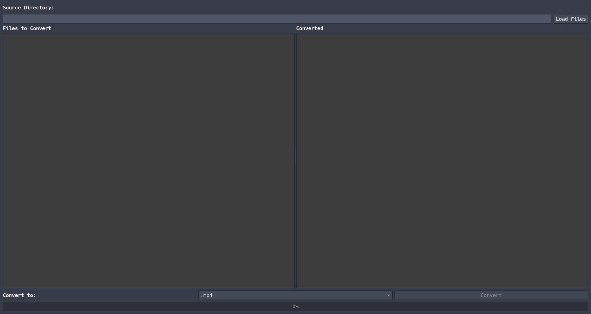

# PYFFMPEGUI
#### Video Demo: 
https://youtu.be/BSPTc9cANEY

---
### Description:

PYFFMPEGUI is a GUI(Graphical User Interface) for converting videos to other video formats.
This is my final project for Harvard CS50x.  If people find this useful, I may expand it with different tabs 
for more FFMPEG functionality, such as reencoding, GPU(Graphical Processing Unut) acceleration for reencoding,
options for different ffmpeg flags such as changing FPS, etc, maybe a tab for converting a series of images to 
a video or a video to images. If there is any interest from the community in this project, I will work on it further,
but for now I feel that it is enough for my final project submission, as I spent a lot of time getting it to this point.
If there is interest, I will add desktop files to be able to launch it on Unix and Windows via the GUI instead of running
it from the CLI(Command Line Interface) which is the only option at the moment. I can also add it to PyPi if there is enough
interest pretty easily as I've already done so with another project.

---

Curently you can select multiple videos and convert them all to an output video format of you choice.
Currently supported choices include:
* mp4 
* mkv 
* avi
* gif 
* mov

Optionally you can pick a source directory(folder) for the files, or the Load Files button will just open a file explorer
to your home directory and you can navigate your file system and select the videos you want. You can select multiple files
at once by ctrl clicking them, and there is a drop down to pick the format. The only files that show are what is selected in the drop down 
on the file explorer. It will handle the GUI and ffmpeg formatting with multithreading, so 
it is fast an efficient, albiet a few bugs I need to work out changing states. I will list known bugs at the end of the README,
and if any more are noticed, I would appreciate if someone opened an issue on them! 😀

---

After Selecting the files to convert, there is a drop down at the bottom of the GUI that lets you select the format to convert it to.
After making sure this is what you want, you can click the Convert button to begin converting the file. Only click it once because it
is a bug that I'm working on to try to get it to not let the user click it again after clicking once. If you click it twice, it will crash
the program. I have tried updating the GUI state to disable the button but I'm cleary doing something wrong 🤦. I'm sure it's something simple
that I can fix, but I'm not worried about it at the moment because I don't know if anyone is even going to use this 🤣. The progress bar only updates 
when the first file is done, and it can take a while naturally for ffmpeg to convert videos, especially if they are long videos.

________________

When the files are done, they should move from the left list of files to be converted, to the right list of files converted. The converted videos
will be of the same name as the original, with the difference being the video extension and format.

___

### Known Bugs:

* The program will crash if you hit the Convert Button twice

* The progress bar only updates when a file is done converting, and it determines the progress based on the number of files to convert.

* After it's done converting files, it won't let you load more files to convert without closing and reopening. I just now discovered this :(

* If the destination file already exists, it will ask the launching terminal if you want to overwrite it. At least on Linux anyway.
I'm on Arch Linux btw and haven't tested it on Windows or Mac.
